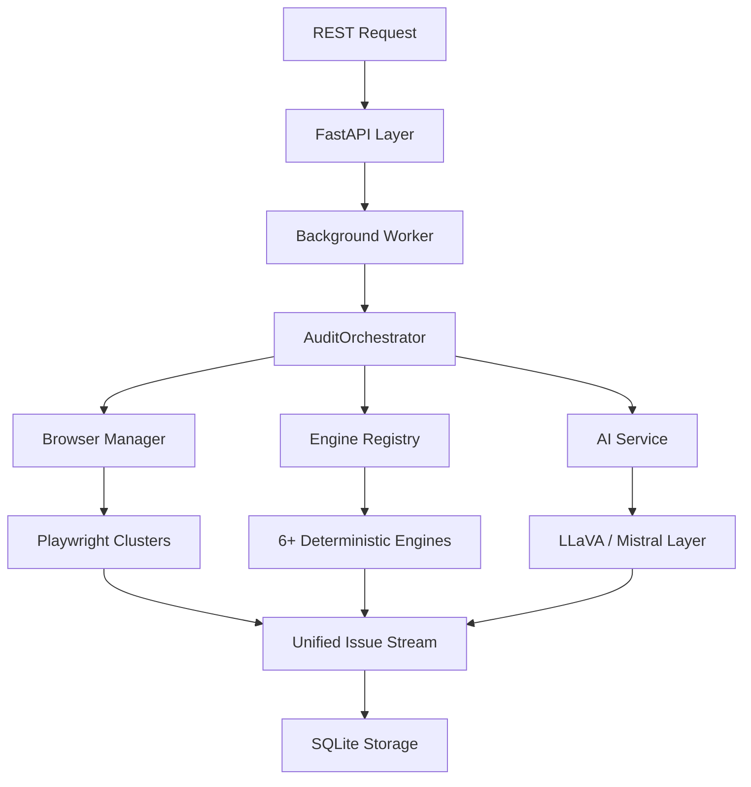

# AccessLens Backend Architecture

AccessLens is a high-performance accessibility auditing platform that combines deterministic rule-based analysis with AI-powered contextual insights.

## System Orchestration

The backend architecture follows a non-blocking, asynchronous flow to ensure high throughput and reliability.

### Request Lifecycle
1. **API Entry**: FastAPI validates the URL and options.
2. **Backgrounding**: The request is offloaded to a `BackgroundTask` to free the worker thread.
3. **Orchestration**: `AuditOrchestrator` coordinates browser acquisition and engine execution.
4. **Synthesis**: Results from all engines are de-duplicated and normalized into the `UnifiedIssue` format.

---

## Analysis Engines

AccessLens uses a multi-engine approach to achieve maximum sensitivity across different accessibility categories.

### 1. WCAG Engine (Deterministic)
- **Core**: Powered by `axe-core` via `axe-playwright-python`.
- **Capability**: Industry-standard checking for automated accessibility violations.
- **Safety**: Implements 30s timeout guards and handles diverse AXE output formats.

### 2. Contrast Engine (Visual)
- **Logic**: Evaluates computed CSS colors utilizing `getComputedStyle`.
- **States**: Simulates interactive states (hover/focus) to detect contrast failures in dynamic elements.
- **Precision**: Uses WCAG 2.1 contrast formulas for deterministic validation.

### 3. Structural & Form Engines (Semantic)
- **Logic**: Deconstructs the DOM to verify heading hierarchies and ARIA landmarks.
- **Validation**: Ensures label-input associations and correct usage of `aria-describedby` for error states.

### 4. Navigation & Heuristic Engines (UX)
- **Logic**: Simulates keyboard Tab sequences to detect focus traps.
- **Analysis**: Checks for deceptive link text ("click here") and estimates content reading complexity.

---

## AI Integration Layer

The "Intelligence" in AccessLens comes from its contextual layer, which deepens the audit where deterministic rules fail.

### Core Pipelines
- **Vision Recognition (LLaVA)**: Analyzes page screenshots to detect visual barriers like poor spacing, clutter, or visual focus indicators that code-only checkers miss.
- **Refactoring Synthesis (Mistral 7B)**: Dynamically generates accessible code patches (`RemediationSuggestion`) for both deterministic and AI-found issues.
- **Contextual Synthesis**: In "Hybrid" mode, the AI layer enriches all findings with confidence-scored metadata and expert repair strategies.

---

## Data Strategy

- **Persistence**: All audit results are stored in **SQLite**, ensuring a lightweight yet robust history.
- **Artifacts**: Screenshots and DOM snapshots are indexed via UUID and stored in the `/data` directory.
- **Metrics**: Integrated Prometheus exporters track audit duration and issue density across engines.

---

## Evolutionary Roadmap

The platform is continuously evolving to handle modern web complexities:
1. **Visual Focus Indicators**: Improving automated detection of missing focus rings on interactive elements.
2. **Shift+Tab Traversal**: Expanding navigation checks to include reverse keyboard paths.
3. **Dynamic SPA Support**: Support for re-auditing pages after complex state migrations.

*Built with precision for the modern web.*
