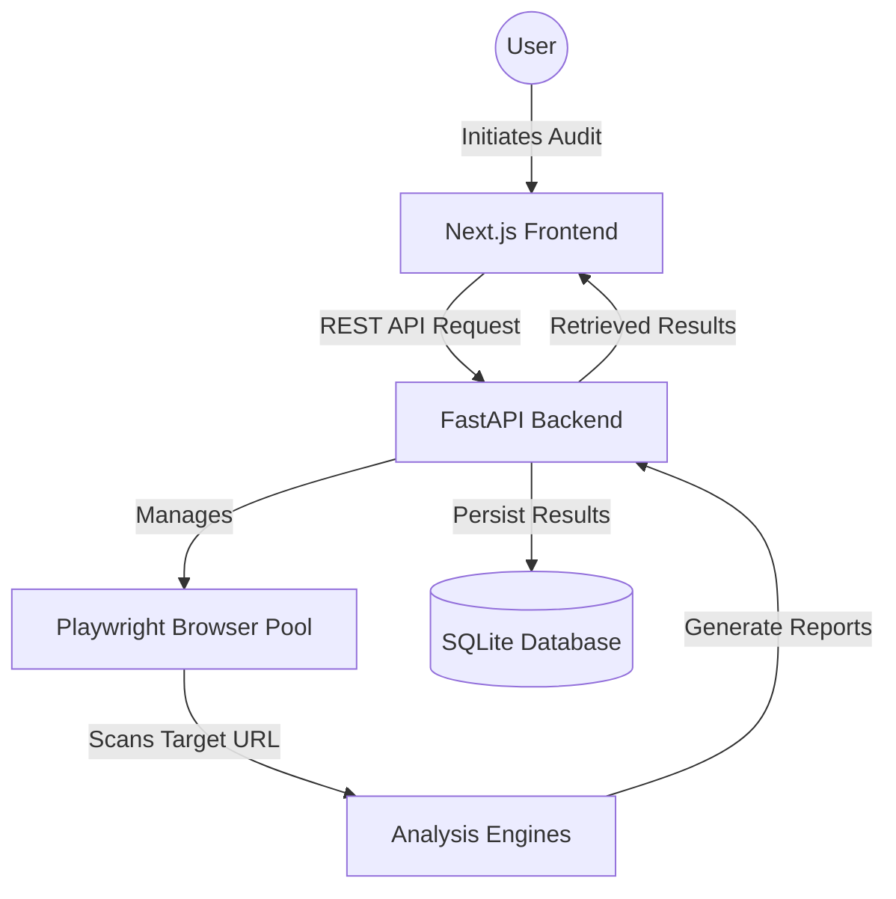

# AccessLens Architectural Overview

AccessLens is a high-performance, AI-driven accessibility auditing platform designed to provide deep, multi-engine analysis of web applications.

## High-Level System Architecture

AccessLens follows a modern decoupled architecture with a Python-based analysis backend and a Next.js-based visualization frontend.

### 1. Analysis Backend (Python/FastAPI)
The core intelligence layer responsible for:
- **Audit Orchestration**: Managing the lifecycle of an audit request.
- **Browser Lifecycle**: Pooling and managing headless Playwright instances.
- **Engine Synthesis**: Running multiple accessibility engines (Axe-Core, Pa11y, etc.) and synthesizing results.
- **Data Persistence**: Storing audit records, snapshots, and metrics.

### 2. Visualization Frontend (Next.js 14)
A premium, HUD-inspired dashboard for:
- **Intelligence Dashboard**: Real-time overview of recent audit activity.
- **Spatial Map (Heatmap)**: Visualizing accessibility barriers directly on page screenshots.
- **Architectural Explorer**: Navigating the accessibility tree (AX Tree).
- **Executive Summaries**: AI-synthesized briefings for rapid understanding.

### 3. Engine Intelligence
AccessLens uses a "Collective Intelligence" approach, combining:
- **Heuristic Engines**: Rule-based scanners (WCAG 2.1/2.2).
- **Spatial Detectors**: Analyzing layout and visual contrast.
- **Structural Analyzers**: Deconstructing the DOM and Accessibility Tree.

## Technical Stack

| Layer | Technology |
| :--- | :--- |
| **Frontend** | Next.js 14 (App Router), React Query, Framer Motion, Tailwind CSS v4, Lucide Icons |
| **Backend** | Python 3.10+, FastAPI, Playwright (Async), SQLModel / SQLite |
| **Analysis** | Axe-Core, Custom Heuristic Engines, PIL (Spatial Analysis) |
| **Documentation** | Markdown, Mermaid.js |

## Key Directories

- `/backend`: Core Python logic, engines, and API.
- `/frontend`: Next.js application and UI components.
- `/docs`: Centralized documentation hub.
- `/backend/data`: Persistent storage for screenshots and session data.
- `/models`: (Optional) Repository for local LLM weights (bypassed in API mode).
