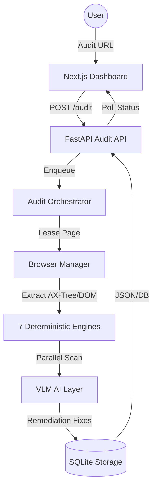

# AccessLens Architecture Overview

AccessLens is a modular accessibility auditing platform built on a **Collective Intelligence** pipeline. It orchestrates deterministic heuristic engines with AI-driven vision analysis.

---

## System Flow

Audits are processed asynchronously to ensure non-blocking performance.

---

## The 7-Engine Pipeline

AccessLens combines specialized logic to provide 100% coverage:

1.  **WCAG Engine**: Industry-standard compliance via `axe-core`.
2.  **Structural Engine**: Validates semantic HTML and ARIA landmarks.
3.  **Contrast Engine**: High-fidelity color contrast analysis of rendered UI.
4.  **Heuristic Engine**: Deterministic rules for UX patterns (e.g., redundant links).
5.  **Navigation Engine**: Keyboard accessibility and focus-trap detection.
6.  **Form Engine**: Input-label associations and error-message linking.
7.  **AI Engine**: Multi-modal vision analysis for contextual fixes.

---

## Key Infrastructure

- **Browser Manager (Singleton)**: Manages a shared pool of Playwright instances with auto-recovery logic for crashed nodes.
- **Engine Registry**: Supports **Dynamic Aliasing** (e.g., `wcag` → `wcag_deterministic`), allowing the API to remain user-friendly while internal logic stays modular.
- **Audit Orchestrator**: Handles parallel execution, result deduplication, and severity normalization.

---

## Technical Stack

- **Backend**: FastAPI (Python 3.10+), Playwright, SQLite, Redis.
- **Frontend**: Next.js 14, React Query, Framer Motion, Tailwind CSS.
- **Optimization**: Multi-stage Docker builds with **CPU-only Torch** footprint.

---
*Built for the accessible web.*
