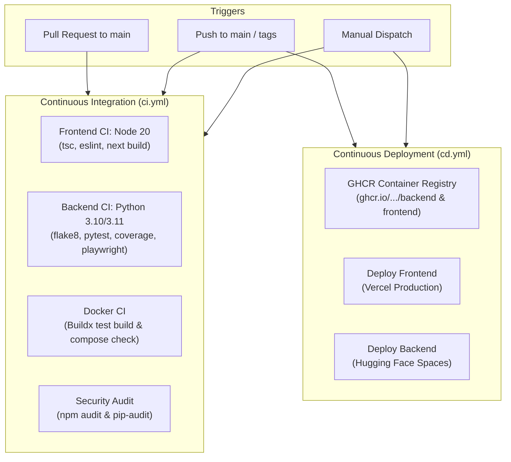

# AccessLens CI/CD Pipeline Setup Guide

This document explains the Continuous Integration and Continuous Deployment (CI/CD) pipelines configured for **AccessLens** and provides a checklist of the steps you need to perform to activate and customize them.

---

## 1. Pipeline Architecture

AccessLens uses GitHub Actions to automate code quality checks, security audits, container builds, and production deployments.



---

## 2. Immediate Steps Required (One-Time Setup)

To get your CI/CD pipeline active and working with zero external costs or third-party accounts, complete the following two steps:

### Step 2.1: Commit and Push the Files to GitHub
From your terminal in the `Accesslens` project root, push the new workflow files to your GitHub repository:

```bash
git add .github/ docs/CICD_SETUP.md README.md
git commit -m "ci: add GitHub Actions CI/CD pipelines and setup documentation"
git push origin main
```

### Step 2.2: Enable Package Write Permissions for GitHub Container Registry (GHCR)
The CD pipeline automatically builds and publishes Docker images to GitHub Container Registry using the built-in `GITHUB_TOKEN`. By default, GitHub Actions may have read-only permissions for packages.

1. Go to your GitHub repository in your browser.
2. Click on **Settings** (top tab bar).
3. In the left sidebar, navigate to **Actions** → **General**.
4. Scroll down to **Workflow permissions**.
5. Select **Read and write permissions**.
6. Check the box **Allow GitHub Actions to create and approve pull requests** (optional, recommended).
7. Click **Save**.

> [!TIP]
> Once saved, any push to `main` will automatically build and publish your backend and frontend Docker images to GitHub Packages (`ghcr.io/<your-username>/accesslens/backend` and `frontend`).

---

## 3. Optional Steps for Automated Cloud Deployment

If you want the pipeline to automatically deploy your live Frontend to **Vercel** and Backend to **Hugging Face Spaces**, add the following secrets in GitHub:

Navigate to **Settings** → **Secrets and variables** → **Actions** → **New repository secret**.

### A. Frontend Deployment (Vercel)
If you host your Next.js frontend on Vercel:

| Secret Name | Description | Where to Find It |
| :--- | :--- | :--- |
| `VERCEL_TOKEN` | Vercel Personal Access Token | [Vercel Account Settings → Tokens](https://vercel.com/account/tokens) |
| `VERCEL_ORG_ID` | Vercel Team / Account ID | Found in project settings or `.vercel/project.json` (`orgId`) |
| `VERCEL_PROJECT_ID` | Vercel Project ID | Found in your Vercel Project Settings (`projectId`) |

> *Note: If these secrets are not added, the workflow will gracefully notice and skip Vercel deployment without failing your build.*

### B. Backend Deployment (Hugging Face Spaces)
If you host your FastAPI backend on Hugging Face Spaces:

| Secret Name | Description | Where to Find It |
| :--- | :--- | :--- |
| `HF_TOKEN` | Hugging Face Access Token (Role: **Write**) | [Hugging Face Settings → Access Tokens](https://huggingface.co/settings/tokens) |
| `HF_SPACE_REPO` | Space name formatted as `username/space-name` | E.g., `sansritimishra/accesslens-backend` |

> *Note: If these secrets are not added, the workflow will gracefully notice and skip Hugging Face sync without failing your build.*

### C. Custom Production API URL (Optional)
| Secret Name | Description | Default If Omitted |
| :--- | :--- | :--- |
| `PROD_API_URL` | Public URL of your backend API for the frontend build | `http://localhost:8000/api/v1` |

---

## 4. How the Workflows Run

### Continuous Integration (`.github/workflows/ci.yml`)
- **When it runs:** On any Pull Request or Push to `main`, `master`, or `develop`.
- **What it executes:**
  1. **Frontend**: Runs `npm ci`, checks TypeScript types (`npx tsc --noEmit`), runs ESLint (`npm run lint`), and builds the Next.js production bundle.
  2. **Backend**: Matrix test across Python 3.10 and 3.11. Installs dependencies, sets up Playwright Chromium headless, validates code syntax with `flake8`, and executes `pytest` with coverage report generation.
  3. **Docker**: Tests multi-stage Docker builds for backend and frontend, and validates `docker-compose.yml` config.
  4. **Security**: Runs automated audits (`npm audit` and `pip-audit`).

### Continuous Deployment (`.github/workflows/cd.yml`)
- **When it runs:** On push to `main`, on Git release tags (`v*.*.*`), or via manual trigger.
- **Manual Trigger**:
  1. Go to the **Actions** tab on your GitHub repository.
  2. Select **Continuous Deployment (CD)** in the left sidebar.
  3. Click **Run workflow**, choose a target (`all`, `ghcr_only`, `vercel_only`, or `huggingface_only`), and run.

---

## 5. Summary Checklist

- [ ] Push `.github/` folder to GitHub repository.
- [ ] Set **Workflow permissions** to **Read and write permissions** in GitHub repository settings.
- [ ] (Optional) Add `VERCEL_TOKEN`, `VERCEL_ORG_ID`, `VERCEL_PROJECT_ID` for automated frontend deployments.
- [ ] (Optional) Add `HF_TOKEN` and `HF_SPACE_REPO` for automated backend deployments.
- [ ] View the first successful run in the GitHub Actions tab!
