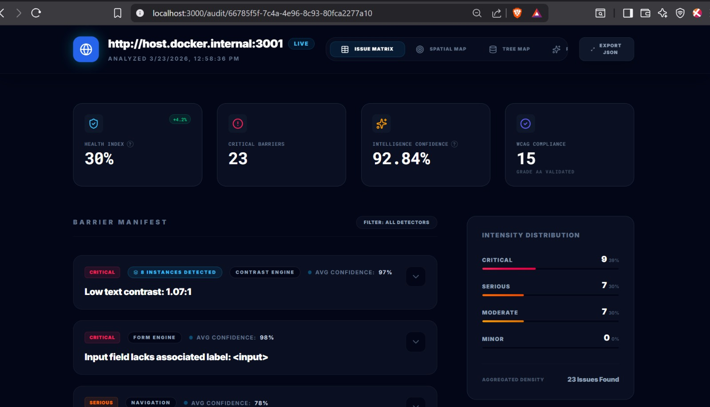

# Setup & Deployment Guide

This guide provides step-by-step instructions for setting up the AccessLens platform in development and production environments.

## Prerequisites

- **Python**: 3.10 or higher
- **Node.js**: 20.x (recommended for Tailwind v4 support)
- **Playwright**: Installed via `playwright install`
- **SQLite**: (Built-in to Python)

---

## 1. Backend Setup

The backend handles audit orchestration, browser management, and engine analysis.

1. **Clone the repository and enter the backend directory**:
   ```bash
   cd AccessLens/backend
   ```

2. **Create and activate a virtual environment**:
   ```bash
   python -m venv venv
   # Windows:
   .\venv\Scripts\activate
   # macOS/Linux:
   source venv/bin/activate
   ```

3. **Install dependencies**:
   ```bash
   pip install -r requirements.txt
   playwright install chromium
   ```

4. **Configuration**:
   Copy `.env.example` to `.env` and adjust settings (database URL, local AI model paths, etc.).

5. **Run the server**:
   ```bash
   python run.py
   ```
   The backend will be available at `http://localhost:8000`.

> [!NOTE]
> **AI Models**: By default, AccessLens connects to LLaVA and Mistral via local endpoints. 
> 1. Download the model weights to the root `models/` directory.
> 2. Configure the appropriate paths in your `.env`.

---

## 2. Frontend Setup

The frontend is a Next.js application for visualizing audit results.

1. **Enter the frontend directory**:
   ```bash
   cd AccessLens/frontend
   ```

2. **Install dependencies**:
   ```bash
   npm install
   ```

3. **Configuration**:
   Ensure `.env.local` points to the correct backend API:
   ```env
   NEXT_PUBLIC_API_URL=http://localhost:8000
   ```

4. **Run the development server**:
   ```bash
   npm run dev
   ```
   The dashboard will be available at `http://localhost:3000`.

---

## 3. Production Deployment (Docker)(Prefer this)

AccessLens uses a root-level `docker-compose.yml` for unified orchestration.

1. **Build and start all services**:
   ```bash
   # From the project root
   docker-compose up --build -d
   ```

2. **Access the platform**:
   - Dashboard: `http://localhost:3000`
   - Backend API: `http://localhost:8000/api/v1`

3. **Check logs**:
   ```bash
   docker-compose logs -f
   ```

> [!TIP]
> **Auditing Host Services**: If you are running AccessLens in Docker and want to audit a service running directly on your host machine (e.g., another dev server at `localhost:3001`), use `http://host.docker.internal:3001` in the audit URL. Inside a container, `localhost` refers to the container itself.
>
> 

---

## 4. Troubleshooting

- **Browser Crashes**: Ensure `playwright install chromium` was successful and that your environment has required libraries.
- **Database Errors**: If `accesslens.db` needs a reset, delete the file and restart the backend.
- **Port Conflicts**: If the application fails to start because a port is in use, use the following commands (Windows):
    - **Find PID**: `netstat -ano | findstr :<PORT>` (e.g., `netstat -ano | findstr :8000`)
    - **Identify Process**: `tasklist /FI "PID eq <PID>"` or `Get-Process -Id <PID>`
    - **Kill Process**: `taskkill /F /PID <PID>`

---
*Built with precision for the modern web.*
